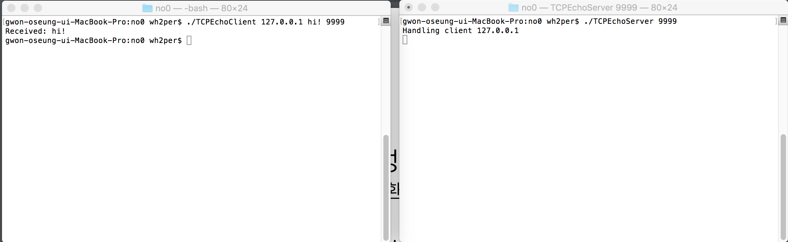
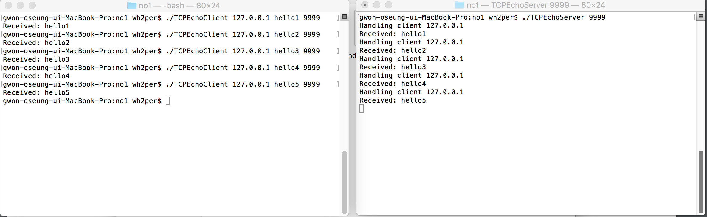
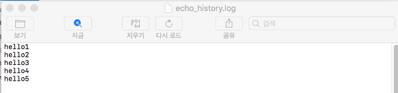
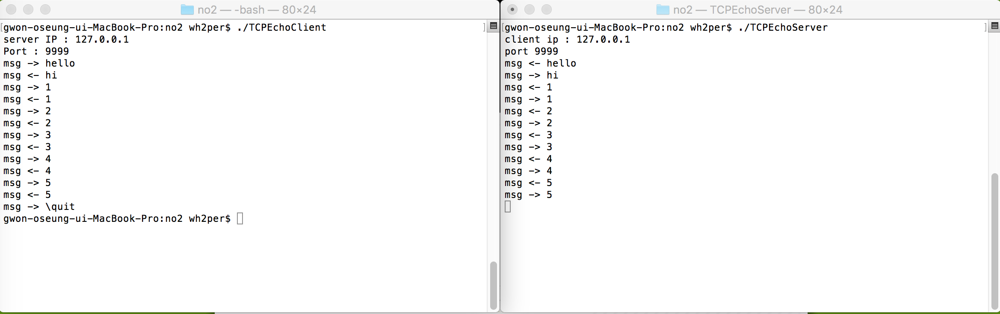
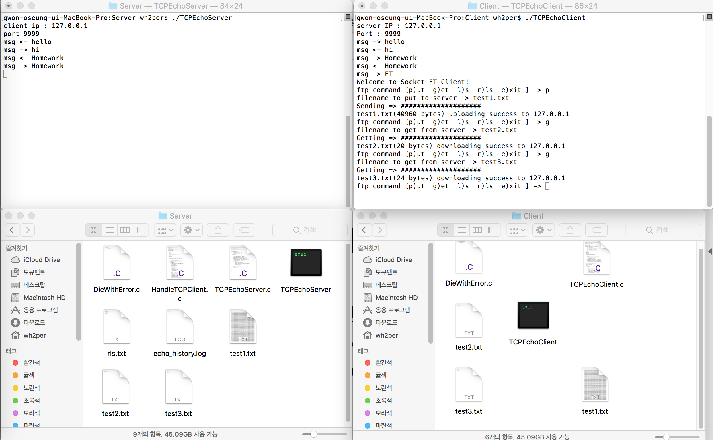
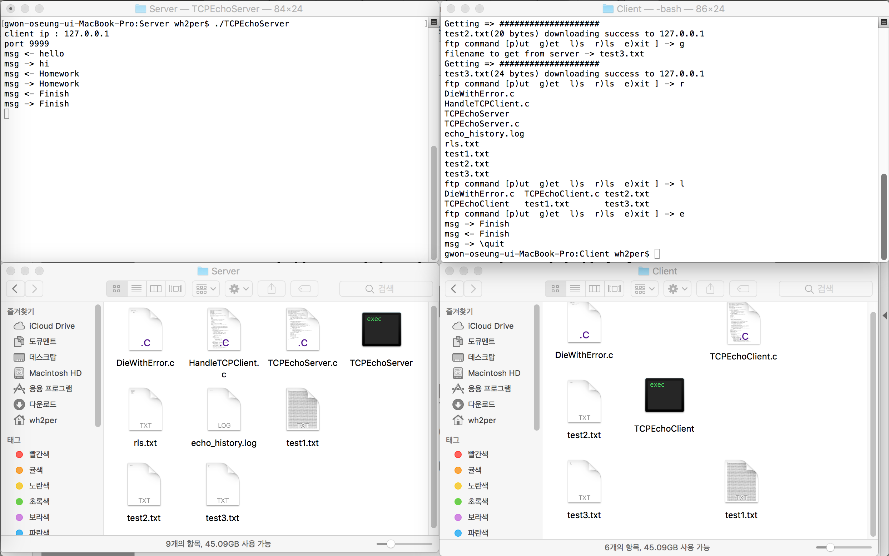
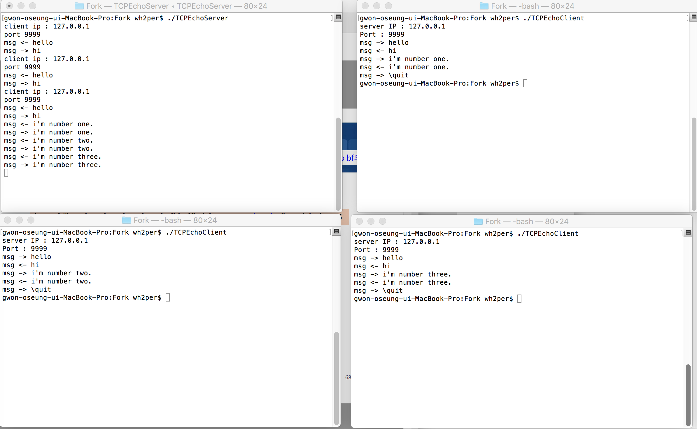
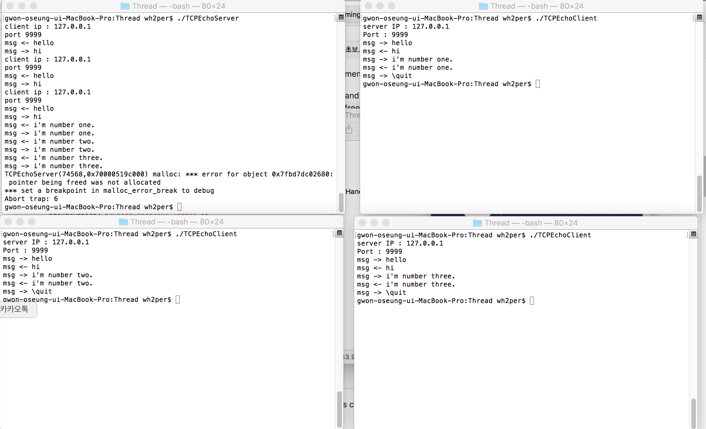
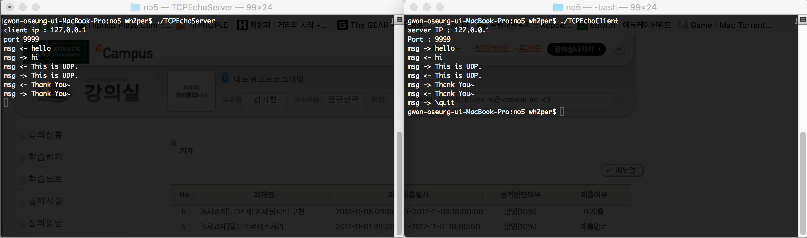
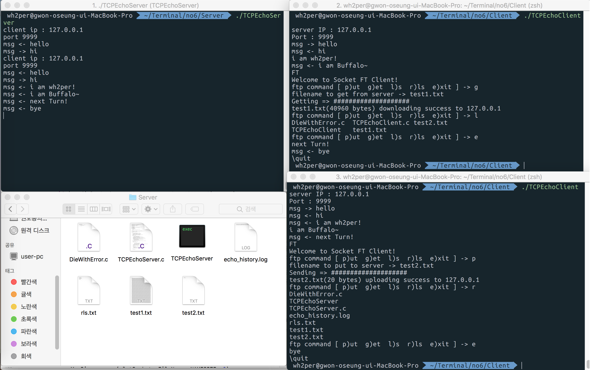

# TCP-IP-Practice-FTP
## ScreenShot
### 1. no0 - Connect
  + #### Server, Client
     
### 2. no1 - Message History
  + #### Server, Client
    
  + #### Server, Client
          
### 3. no2 - Echo Server
  + #### Server, Client
     
### 4. no3 - put, get, rls, ls, exit
  + #### Server, Client, dir - put, get
       
  + #### Server, Client, dir - put, get
         
### 5. no4 - Fork, Thread
  + #### Server, Client - Fork
       
  + #### Server, Client - Thread
         
### 6. no5 - UDP
  + #### Server, Client 
       
### 7. no6 - Implement FTP 
  + #### Server, Client, dir
         
