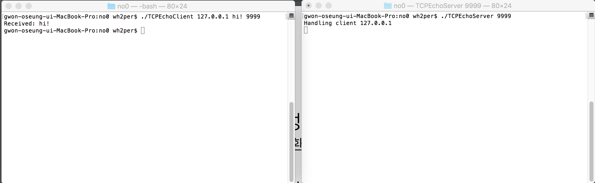
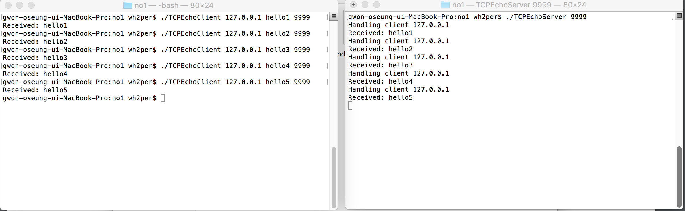
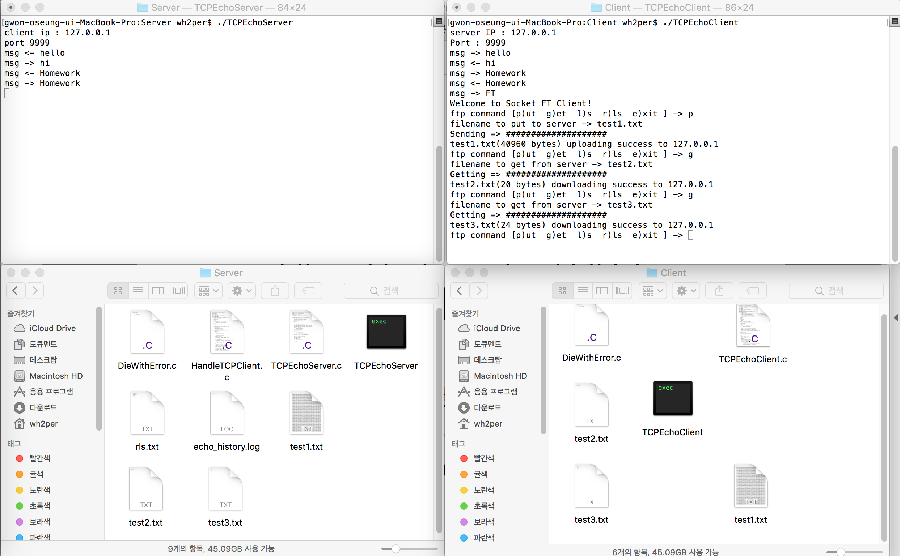
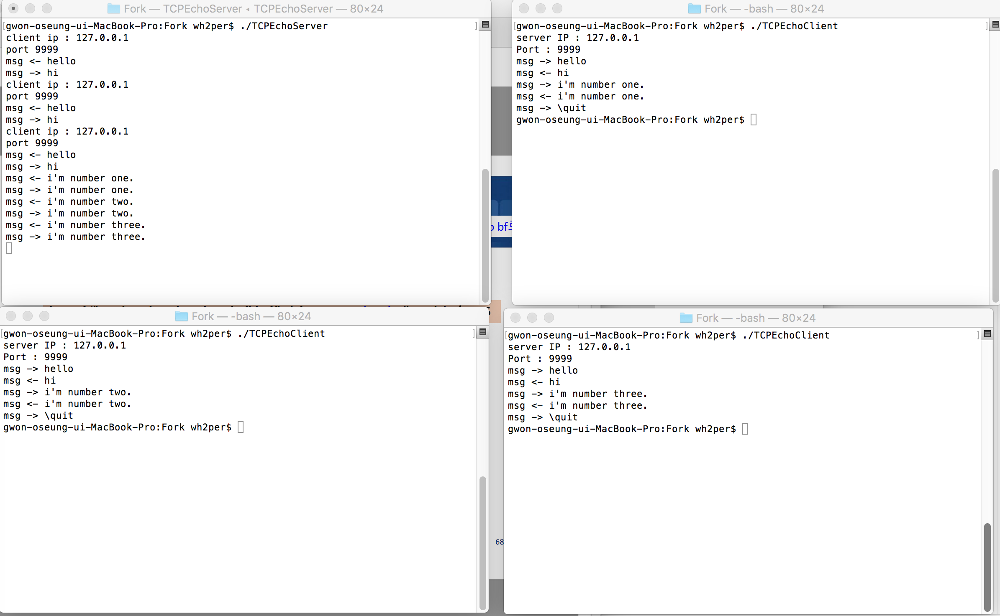
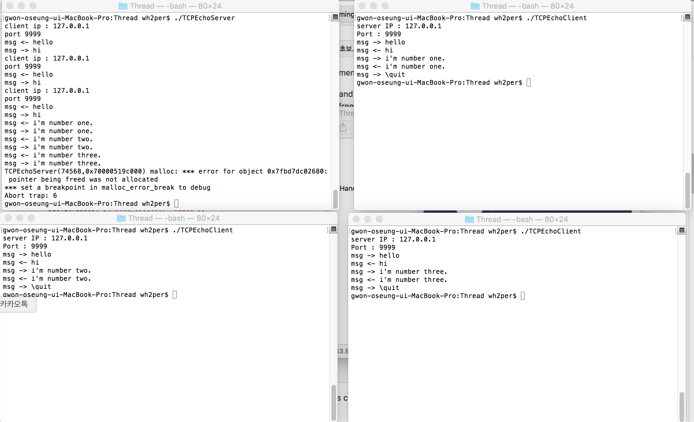

# TCP-IP-Practice-FTP
## ScreenShot
+ ### no0 - Connect
  + #### Server, Client
     
+ ### no1 - Message History
  + #### Server, Client
    
  + #### Input right value
          
+ ### no2 - Echo Server
  + #### Server, Client
     
+ ### no3 - put, get, rls, ls, exit
  + #### Server, Client, dir - put, get
       
  + #### Server, Client, dir - put, get
         
+ ### no4 - Fork, Thread
  + #### Server, Client - Fork
       
  + #### Server, Client - Thread
         
+ ### no5 - UDP
  + #### Server, Client 
       
+ ### no6 - Implement FTP 
  + #### Server, Client, dir
         
