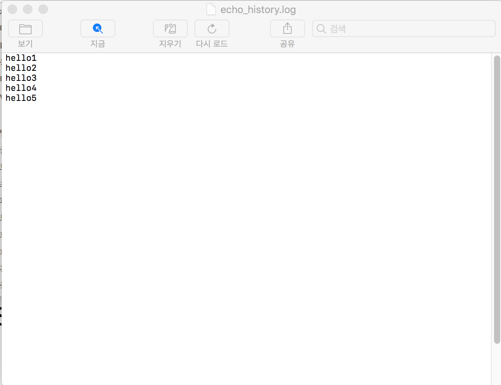

# TCP-IP-Practice-FTP
## ScreenShot
+ ### no0
  + Server, Client
     
+ ### no1
  + Server, Client
    
  + Input right value
        
+ ### no2
  + Server, Client
     
+ ### no3
  + Server, Client, dir - put, get
       
  + Server, Client, dir - put, get
         
+ ### no4
  + Server, Client - put, get
       
  + Server, Client - put, get
         
+ ### no5
  + Server, Client - put, get
       
+ ### no6
  + Server, Client, dir - put, get
         
